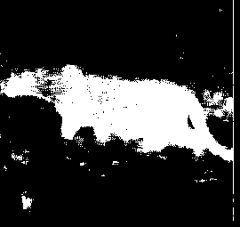
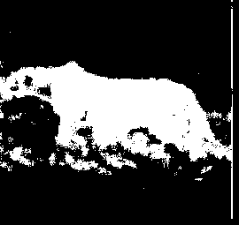
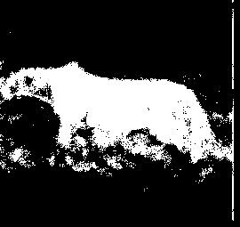
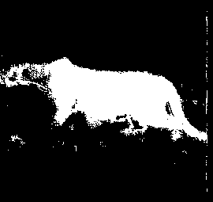

# Cheetah Image Segmentation

## Original Image

## Ground Truth Mask

## Naive Bayes

Error Rate = 0.1727

## Maximum Likelihood Using Best 8 Features

Error Rate = 0.05421

## Maximum Likelihood Using All Features

Error Rate = 0.08979

## Maximum A Posterior 

Error Rate = 0.08312

## Bayes with predictive distribution

Error Rate = 0.08321

## Gaussian Mixture Model(C = 16)

Error Rate = 0.0485

